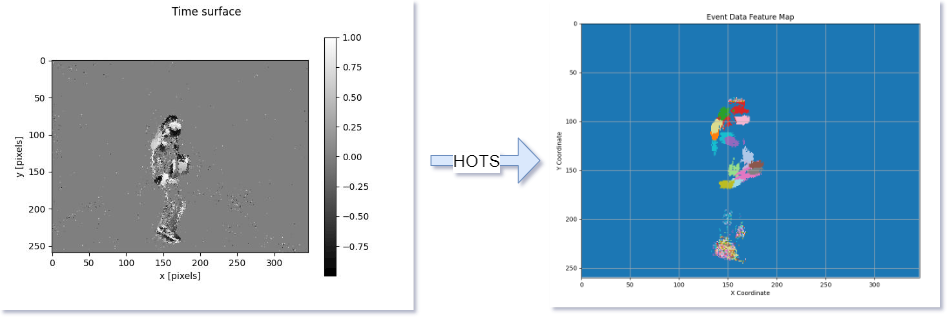
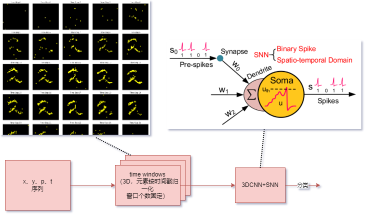

# 概述

1. 利用[HOTS模型](https://github.com/shaunirwin/event_based_time_surfaces/tree/master)和[THU事件相机数据集](https://github.com/lujiaxuan0520/THU-EACT-50)，借助time surface为事件相机的事件流数据抽取特征。

2. 利用S-CNN模型（SNN+CNN，后文简称SNN），将事件流数据转为多图片进行训练（分类任务）。

# 文件
- datasets：数据集文件夹；
- event_Python：HOTS依赖的事件数据处理的[外部库](https://github.com/gorchard/event-Python)；
- lib：HOTS的库；
- HOTS：HOTS的脚本，使用时里面的各种路径要修正；
   - `dataset.py`：读取THU数据集的demo；
   - `process.py`：THU数据集的数据处理；
   - `train_mnist`：用N-mnist手写字（事件相机）数据集进行HOTS训练和抽取特征；
   - `train_THU1`：用THU数据集进行HOTS训练和抽取特征；
   - `train_THU_our`：用THU数据集或项目数据集进行HOTS训练和抽取特征；
- records：记录；
- SNN：SNN用到的函数、类；
   - `snn.py`：snn网络；
   - `snn_process`.py：snn的处理工具；
- `data_transform.py`：将事件流转为脉冲张量保存，可以像一般网络一样快速训练；
- `main.ipynb`：开发中；
- `snn_mnist.py`：用N-mnist手写字（事件相机）数据集进行SNN训练和分类；
- `s3cnn_mnist.py`：用N-mnist手写字（事件相机）数据集进行SNN训练和分类，使用3d卷积；